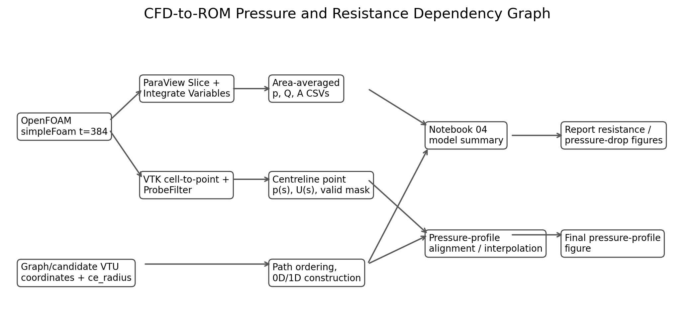
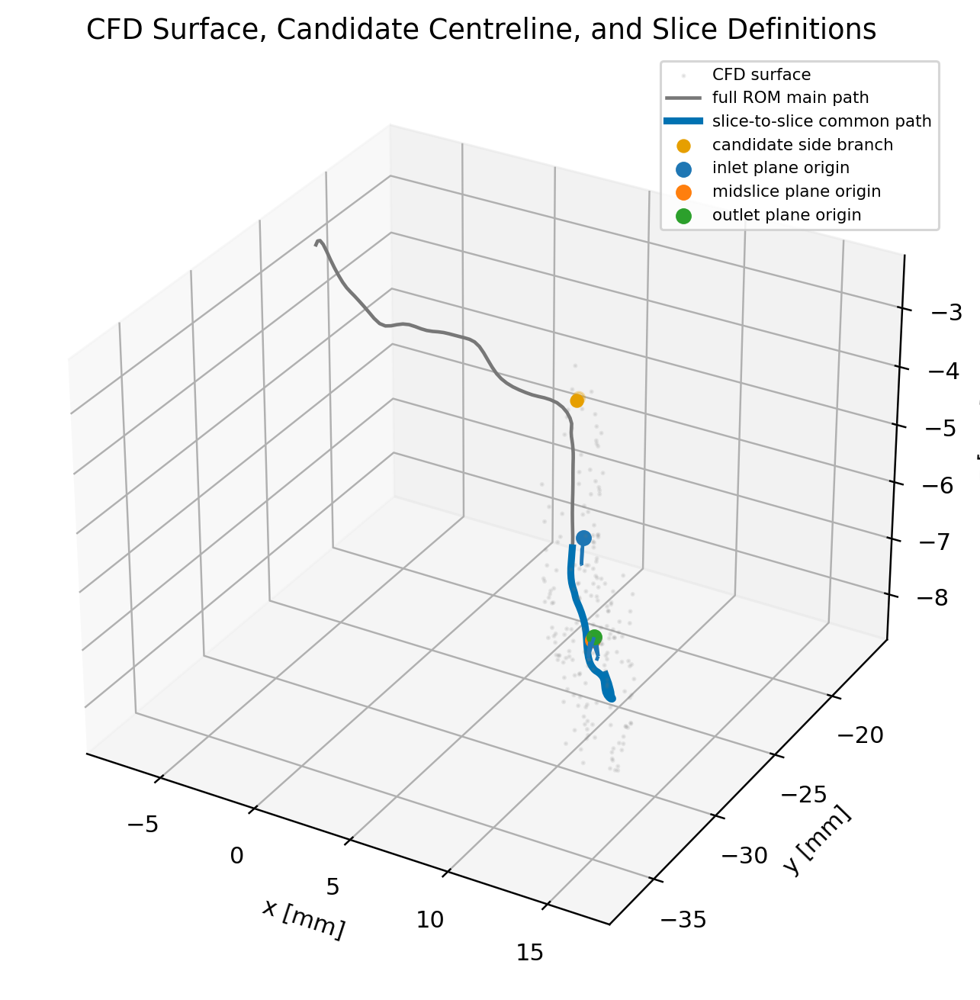
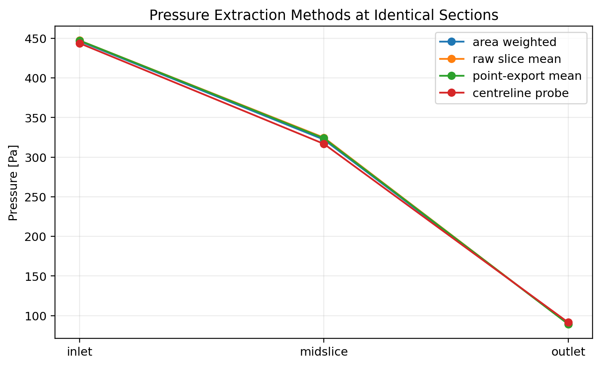
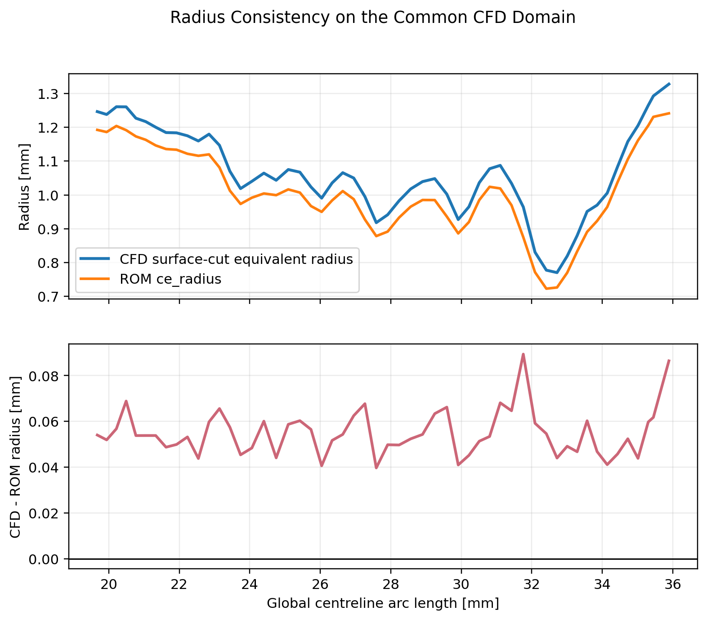
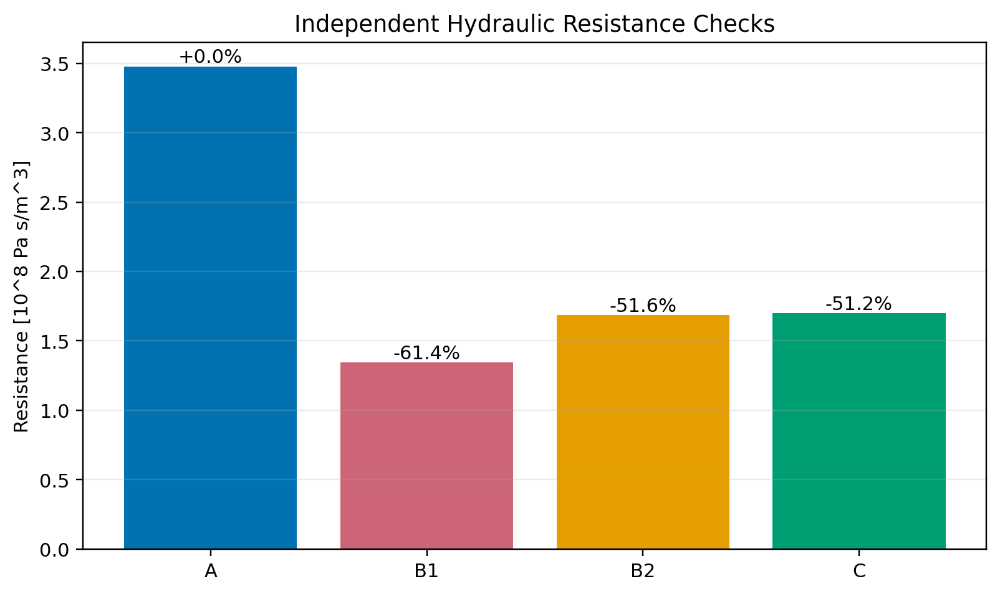

# CFD versus Reduced-Order Workflow Audit

## Scope and audit rule

This audit traces the existing OpenFOAM, ParaView, centreline, 0D, 1D, and
reporting workflow without modifying any analysis notebook. Numerical evidence
was regenerated by `scripts/audit_cfd_rom_workflow.py`.

The approximately 50% pressure-drop disagreement is real for the current
**uncalibrated Poiseuille-based** reduced models on the aligned domain. It is
not explained by plotting or pressure extraction. However, several older
comparisons also contained serious geometry-selection errors that sometimes
produced accidental agreement.

## Executive diagnosis

The main findings are:

1. **The comparison to Soudah et al. was conceptually incorrect.** Their reduced
   pressure-loss law was trained against 3D CFD using least-squares coefficients.
   The present 0D/1D models are uncalibrated Hagen-Poiseuille integrations.
   Few-percent agreement after fitting is not evidence that an unfitted
   Poiseuille model should agree within a few percent.
2. **The historical ROM and CFD domains were not identical.** The original ROM
   path covered `0-35.893 mm`; the supplied CFD comparison planes cover
   `19.672-35.893 mm` on that path.
3. **The historical network "CFD-domain" selection is invalid.** A bounding-box
   test selected labels `1, 2, 8`, after which the workflow summed each complete
   label. This totals `60.97 mm` of network and includes side branch label `8`.
   The resulting old 1D resistance happened to lie near CFD by cancellation.
4. **After correct plane-to-plane clipping, local Poiseuille resistance remains
   about 51% below CFD.** This is model-form/CFD-physics disagreement, not a
   coordinate or plotting discrepancy.
5. **Pressure extraction is consistent.** Area-weighted, raw-slice, point-export,
   and centreline pressure drops at identical sections agree within about 1.2%.
6. **The ROM radius is not too large relative to the CFD surface.** CFD
   surface-cut equivalent radii are on average about 5.5% larger than
   `ce_radius`. Using the CFD radius lowers the Poiseuille resistance further.
7. **The supplied outlet plane is poorly aligned.** Its normal differs from the
   local tangent by `30.82 degrees`; inlet and midslice differ by only
   `6.97 degrees` and `4.59 degrees`.

## 1. Quantity lineage and dependency graph



### CFD cross-sectional pressure and flow

| Stage | File/variable | Units and transformation |
|---|---|---|
| OpenFOAM | `p` | Kinematic pressure, `m2/s2` |
| OpenFOAM | `U` | Velocity, `m/s` |
| ParaView Slice | inlet/midslice/outlet planes | Physical coordinates in metres |
| ParaView Integrate Variables | `*_integration_variable.csv` | `p` is surface integral; `U:0..2` are integrated velocity components; `Area` is `m2` |
| Notebook 02/06 | `p_avg = p_integral / Area * rho` | Area-averaged static pressure, Pa |
| Notebook 02/06 | `Q = abs(dot(integral_U, normal))` | Through-plane flow, `m3/s` |

Pressure is OpenFOAM gauge pressure. Subtracting inlet and outlet values removes
the arbitrary gauge offset.

### CFD centreline pressure

`vtkOpenFOAMReader` loads cell fields at iteration 384. The workflow applies
`vtkCellDataToPointData`, then `vtkProbeFilter` at candidate-centreline points.
This is linear interpolation of the CFD point field. It is **pointwise
centreline pressure**, not a cross-sectional average.

Of 124 main-path points, 62 probe successfully. The original Notebook 02 keeps
their global arc coordinates. A later report implementation recomputed arc
length after dropping invalid points, which incorrectly changed the CFD
coordinate to `0-19.5 mm`.

### Reduced models

The candidate VTU provides cell-wise `ce_radius`, `mis_radius`, and
`voreen_radius` in millimetres. Notebook 03:

- orders the main path using graph topology,
- converts length and radius to metres,
- computes `R_i = 8 mu L_i/(pi r_i^4)`,
- sums resistors for native 0D,
- harmonically coarsens `r^4` for the N=50 model,
- exports a radius/geometry profile for the nominal 1D representation.

Notebook 04 imports the scalar CFD drop and ROM resistance tables, applies one
common flow, and exports `model_comparison_summary.csv`.

Detailed transformations and risks are in
[`interpolation_transformations.csv`](interpolation_transformations.csv).

## 2. Geometry alignment



### Original endpoints versus CFD comparison planes

| Location | CFD plane origin [m] | Original ROM endpoint [m] | Distance |
|---|---|---|---:|
| Inlet | `(0.005927, -0.021678, -0.006867)` | `(-0.007252, -0.023240, -0.002688)` | `13.913 mm` |
| Outlet | `(0.014722, -0.034623, -0.005147)` | `(0.015158, -0.034405, -0.005771)` | `0.792 mm` |

The inlet plane intersects the ROM path at global `s=19.672 mm`, not at the ROM
endpoint `s=0`. The midslice intersects at `27.313 mm`. The outlet plane lies
`0.056 mm` beyond the final candidate node, so the common geometry is conservatively
terminated at the final node, `s=35.893 mm`.

The physically aligned comparison domain is therefore:

```text
global s = 19.6716 to 35.8927 mm
length   = 16.2211 mm
```

The CFD mesh itself extends beyond these internal comparison slices. Its patch
centroids are approximately:

```text
CFD inlet patch  = (0.003762, -0.019441, -0.006219) m
CFD outlet patch = (0.016366, -0.035302, -0.005910) m
```

Thus the measured inlet/outlet slices are not the OpenFOAM boundary patches.

Full coordinates are in [`geometry_alignment.csv`](geometry_alignment.csv).

## 3. Centreline consistency and provenance

The candidate VTU contains 126 points and 125 line cells with three terminal
nodes and one degree-three branch point. Its main path contains 124 points and
123 edges; two points form a side branch.

Evidence that it was extracted from a larger graph:

- `vtkOriginalPointIds` and `vtkOriginalCellIds` are retained.
- Main-path original point IDs are predominantly contiguous (`57-180`).
- The side branch uses IDs `638-639`.
- Cell labels are `1`, `2`, and `8`.

No smoothing or resampling operation is recorded in the candidate file. The
notebooks reorder points topologically and recompute Euclidean arc length.

Independent source verification is currently blocked:

- `data/graph_mr_025.vtp` and `data/mr_limited/graph_mr_025.vtp` are byte-for-byte
  identical.
- Both are malformed XML and unreadable by the installed VTK reader.
- `segment_test_surface.vtp` is likewise not readable by the current VTK reader.
- The candidate VTU was created after the committed STL and is currently
  untracked, so its generation command is not preserved in Git history.

No separate clipped-centreline file exists in the repository. The "clipping" in
analysis is performed by masks and path selection.

## 4. Pressure extraction comparison



| Slice | Area weighted [Pa] | Raw slice mean [Pa] | Point-export mean [Pa] | Centreline [Pa] |
|---|---:|---:|---:|---:|
| Inlet | 446.313 | 447.227 | 447.190 | 443.754 |
| Midslice | 322.148 | 324.681 | 323.860 | 316.771 |
| Outlet | 89.947 | 89.379 | 89.373 | 91.446 |

Corresponding inlet-to-outlet drops are approximately:

```text
area weighted    356.366 Pa
raw slice mean   357.847 Pa
point mean       357.817 Pa
centreline       352.308 Pa
```

The maximum method effect is roughly 1.2%, far below the observed 50% model
gap. The previous `412 Pa` centreline drop arose from using the first valid
probe point rather than the supplied inlet section.

## 5. Slice definitions and plane alignment

| Slice | Global s [mm] | Plane-origin offset from centreline [mm] | Normal/tangent angle |
|---|---:|---:|---:|
| Inlet | 19.672 | 0.470 | 6.97 degrees |
| Midslice | 27.313 | 0.396 | 4.59 degrees |
| Outlet | 35.949 extrapolated | 0.762 | 30.82 degrees |

A plane perpendicular to the vessel has its normal parallel to the local
centreline tangent, so the ideal angle is zero. Inlet and midslice are
acceptable. The outlet is substantially oblique and should be regenerated for
future definitive measurements. Its obliquity can bias area and weighting, but
the observed flow conservation indicates it does not explain a 50% error.

## 6. Radius consistency



At every common-domain centreline station, the CFD STL was cut by a plane normal
to the local tangent. The closed contour area was converted to equivalent
radius `sqrt(A/pi)`.

```text
CFD equivalent radius mean = 1.066 mm
ROM ce_radius mean         = 1.012 mm
mean CFD-ROM difference    = +0.055 mm
mean relative difference   = +5.49%
correlation                = 0.997
```

The radius shapes agree very closely. The ROM radius is systematically smaller,
which should make ROM Poiseuille resistance **higher**, not lower. Radius
estimation therefore cannot explain why CFD resistance is twice the ROM value.

The candidate centreline is offset from CFD section centroids by about
`0.126 mm` on average. Nearest-wall distance must not be used as radius because
that offset strongly biases it.

Pointwise values are in [`radius_consistency.csv`](radius_consistency.csv).

## 7. Independent resistance calculations



| Method | Resistance [Pa s/m3] | Difference from CFD |
|---|---:|---:|
| A: area-averaged CFD `DeltaP/Q` | `3.4764e8` | reference |
| B1: Poiseuille integral with CFD surface-cut radius | `1.3430e8` | `-61.4%` |
| B2: Poiseuille integral with ROM `ce_radius` | `1.6841e8` | `-51.6%` |
| C: clipped native 0D resistor sum | `1.6977e8` | `-51.2%` |

Methods B2 and C agree, confirming that the native 0D implementation correctly
integrates its own radius field. Their disagreement with Method A is therefore
not an indexing or summation bug on the aligned domain.

Method B1 is even lower because the CFD-derived equivalent radius is slightly
larger. The remaining discrepancy is pressure loss present in CFD but absent
from a steady, fully developed, local Poiseuille law.

## 8. Flow, velocity, and area

| Slice | Area [mm2] | Q [mL/s] | Bulk normal velocity [m/s] |
|---|---:|---:|---:|
| Inlet | 4.9865 | 1.02137 | 0.20483 |
| Midslice | 3.0951 | 1.02743 | 0.33195 |
| Outlet | 5.6834 | 1.02650 | 0.18061 |

The slice-to-slice flow spread is `0.591%`, which supports conservation but is
not machine precision. The old scalar comparison used `1.033396 mL/s`, about
`0.81%` above the slice mean `1.025101 mL/s`. This is too small to cause a 50%
pressure-drop discrepancy.

Bulk total-pressure values (`p + rho U_bulk^2/2`) are 468.55, 380.55, and
107.24 Pa. The inlet-to-outlet bulk kinetic correction is only about 4.95 Pa,
so comparing total rather than static pressure does not close the gap.

## 9. Interpolation and transformation defects

### Verified transformations

- Kinematic-to-physical pressure conversion is correct.
- ParaView area averaging is correct.
- Slice flow projection uses the supplied normals.
- Native 0D resistance units are correct.
- Dynamic viscosity is consistent: OpenFOAM `nu=3.3e-6 m2/s` implies
  `mu=0.003498 Pa s`, within 0.06% of the ROM value.

### Defects and risks

1. **Critical:** bounding-box overlap selected graph labels, then the complete
   labels were summed. Marked labels `1,2,8` total 60.97 mm and include a side
   branch.
2. **Critical:** full-path ROM results were compared with CFD pressures measured
   only between internal planes.
3. **High:** one report implementation dropped invalid CFD points and recomputed
   arc length, destroying global coordinate alignment.
4. **High:** the old continuous pressure figure mixed centreline CFD pressure
   with cross-sectional ROM pressure.
5. **Medium:** the outlet slice is oblique by 30.82 degrees.
6. **Medium:** source graph and surface VTP files are currently unreadable, so
   extraction provenance cannot be reproduced.
7. **Low:** pressure averaging choice changes global drop by about 1%.
8. **Low:** flow-source choice changes resistance by less than 1%.

No duplicate main-path points, reversed pressure ordering, or pressure-reference
sign error was found.

## 10. Comparison with Soudah et al. (2014)

The referenced paper is
[Soudah et al., Computational Mechanics 54, 1013-1022](https://doi.org/10.1007/s00466-014-1040-2).
The [institutional record](https://upcommons.upc.edu/entities/publication/3ac19d2e-cbfc-441c-9dbe-2cc8cb7db242)
states that the reduced model is adjusted using a coupled 1D-3D simulation.

Their methodology differs fundamentally:

| Item | Soudah et al. | Current workflow |
|---|---|---|
| Model | Nonlinear 1D plus CFD-trained 3D loss term | Steady Poiseuille resistor integration |
| Loss law | `f3D = k1 Q + k2 abs(Q)Q` | `DeltaP = R_Poiseuille Q` |
| Calibration | `k1,k2` least-squares fitted to 3D pressure loss | No fitting in baseline comparison |
| Pressure quantity | Mean inlet/outlet section values and total-pressure balance | Primarily static area averages; older profile mixed centreline pressure |
| Domain | Same selected 3D inlet/outlet sections | Historically mismatched; now auditable after plane clipping |
| Boundary context | Coupled 1D/3D hemodynamic conditions | Isolated steady 3D segment with fixed velocity and fixed outlet pressure |
| Intended agreement | Trained ROM reproduces its 3D training response | Uncalibrated model tests Poiseuille adequacy |

Soudah's small post-training error cannot be used as an expected error bound for
the present uncalibrated model. Applying a fitted correction
`R_CFD/R_0D = 2.048` would reproduce this one training condition by
construction, analogous to their viscous coefficient, but would require
additional flow states to identify a quadratic coefficient and test prediction.

## 11. Final diagnosis

### Verified correct components

- OpenFOAM converged at iteration 384.
- CFD pressure unit conversion and area averaging.
- Slice flow integration and approximate mass conservation.
- Native 0D Poiseuille summation on a specified radius field.
- Common-domain plane intersection and clipping.
- Pressure offsets are eliminated correctly by pressure loss.
- CFD and ROM radius profiles have strongly correlated shape.

### Incorrect components

- Historical full-path ROM versus internal-slice CFD comparison.
- Historical label-level network summation as a proxy for geometric clipping.
- Inclusion of side branch label `8` in the old "CFD-domain" 1D resistance.
- Recomputed CFD arc length after invalid-point removal in the old report plot.
- Mixed centreline and area-averaged pressure in the old profile figure.
- Claim that the uncalibrated workflow implements the Soudah methodology.

### Ranked sources of the aligned 50% discrepancy

1. **Model-form mismatch, very high confidence.** A local fully developed
   Poiseuille law omits 3D convective, developing-flow, curvature, separation,
   and minor-loss effects. Soudah explicitly fits these effects from CFD.
2. **Developing-flow and boundary proximity, high confidence.** The isolated CFD
   segment is short, uses a fixed-velocity inlet, and the comparison planes are
   only a few diameters from CFD boundaries. A fully developed profile is not
   established over much of the domain.
3. **Outlet-plane obliquity, medium confidence.** The 30.82-degree mismatch
   affects area and weighting, but conserved flow and pressure-method agreement
   limit its likely magnitude.
4. **CFD numerical/mesh effects, low-to-medium confidence.** The solution
   converged and flow is conserved within 0.6%, but no independent mesh
   convergence study or `checkMesh` quality report was found.
5. **Pressure extraction, low confidence.** Independent methods differ by only
   about 1%.
6. **Flow mismatch, low confidence.** Less than 1%.
7. **Radius estimation as cause of high CFD resistance, contradicted.** CFD
   equivalent radius is larger, which lowers Poiseuille resistance.

### Ranked recommended fixes

1. Decide whether the goal is **unfitted Poiseuille assessment** or a
   **CFD-trained Soudah-style ROM**. Do not compare their expected errors.
2. Permanently define the ROM domain by the exact CFD planes, never by graph
   labels or bounding-box-selected labels.
3. Regenerate the outlet plane perpendicular to the local tangent and re-export
   area-averaged pressure and flow.
4. Preserve a readable, version-controlled centreline generated from the exact
   CFD lumen, including the extraction command and source hashes.
5. Extend the CFD inlet/outlet with straight sections or move comparison planes
   away from boundaries to reduce entrance/exit contamination.
6. Run at multiple flow rates. Fit `DeltaP_loss = k1 Q + k2 abs(Q)Q`, then validate
   on held-out flow states if a Soudah-style ROM is desired.
7. Add mesh-convergence and slice-orientation sensitivity studies.
8. Keep centreline pressure only as a local diagnostic; use area-averaged
   cross-sectional pressure for ROM validation.

### Attribution of the discrepancy

| Category | Contribution |
|---|---|
| Geometry/domain | Definite historical error; corrected domain changes results substantially |
| Interpolation | Definite old plotting error; negligible for corrected global resistance |
| Pressure extraction | Not a major cause |
| Radius estimation | Not the cause of high CFD resistance |
| ROM implementation | Native summation is correct; old network label selection is incorrect |
| CFD processing/physics | Likely major contributor through developing and 3D losses |
| Plotting only | No; plotting exposed but did not create the aligned 50% gap |

## Audit artifacts

- [`geometry_alignment.csv`](geometry_alignment.csv)
- [`pressure_method_comparison.csv`](pressure_method_comparison.csv)
- [`radius_consistency.csv`](radius_consistency.csv)
- [`resistance_audit.csv`](resistance_audit.csv)
- [`flow_audit.csv`](flow_audit.csv)
- [`interpolation_transformations.csv`](interpolation_transformations.csv)
- [`geometry_file_hashes.csv`](geometry_file_hashes.csv)

